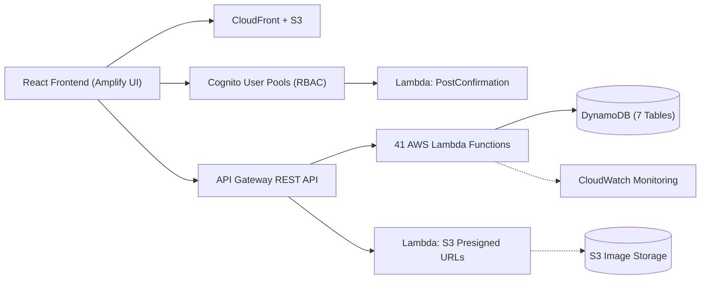
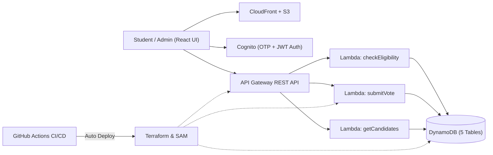

<div align="center">

  <!-- Header Banner -->
  <picture>
    <source media="(prefers-color-scheme: dark)" srcset="https://capsule-render.vercel.app/api?type=cylinder&color=FF9900&height=180&section=header&text=Prathamesh%20Lonare&fontSize=52&fontColor=ffffff&animation=fadeIn&desc=Cloud%20%2F%20DevOps%20Engineer&descSize=18&descAlignY=65&descColor=E6EDF3">
    
  </picture>

  <!-- Typing Subtitle -->
  <a href="https://github.com/prathameshlonare">
    
  </a>

  <br>

  <!-- Direct Links -->
  <a href="https://prathameshlonare.me/"></a>&nbsp;
  <a href="https://drive.google.com/file/d/1bwj41m9DzgKIYDoDX3lLXMpvirutykSz/view?usp=drive_link"></a>&nbsp;
  <a href="https://linkedin.com/in/prathamesh-lonare-a0759b275"></a>&nbsp;
  <a href="mailto:prathameshlonare9@gmail.com"></a>&nbsp;
  <a href="https://github.com/prathameshlonare"></a>

</div>

<br>

## `$ whoami`

```bash
#!/bin/bash
NAME="Prathamesh Lonare"
ROLE="Cloud / DevOps Engineer"
CORE="AWS · Terraform · Docker · CI/CD · Python · Linux"
EDUCATION="B.Tech Computer Science & Engineering (2022 - 2026)"
STATUS="Open to entry-level Cloud & DevOps roles"
```

Computer Science graduate specializing in **AWS cloud infrastructure** and **automated CI/CD delivery**. Experienced in provisioning serverless architectures (Lambda, API Gateway, DynamoDB) and Infrastructure as Code with CloudFormation and Terraform. Currently building hands-on containerized workflows and keyless deployment pipelines.

---

## 🛠️ Technical Stack

| Domain | Technologies & Tools |
|---|---|
| **Cloud (AWS)** | AWS Lambda, API Gateway, DynamoDB, S3, CloudFront, CloudFormation, CloudWatch, Cognito, IAM, VPC |
| **DevOps & CI/CD** | Docker, GitHub Actions, Linux (Ubuntu/Debian), Terraform, Git, Bash |
| **Backend & Scripting** | Python (Boto3), Bash Scripting, REST APIs, JSON/YAML |
| **Monitoring & Security** | AWS CloudWatch (Alarms, Logs), IAM Least-Privilege Policies, OIDC Authentication |

<p align="center">
  <a href="https://skillicons.dev">
    
  </a>
</p>

---

## 🚀 Featured Cloud & DevOps Projects

### 1. [Dorm-and-Dish — Serverless Student Housing Platform](https://github.com/prathameshlonare/Dorm-and-Dish)
> Multi-tier serverless backend deployed on AWS for accommodation and meal service management.



* **Compute & Routing:** 41 AWS Lambda functions managed by Amazon API Gateway REST endpoints for bookings, listings, multi-criteria reviews, and recommendation scoring.
* **Authentication & RBAC:** Amazon Cognito User Pools and user groups enforcing role-based access control for Students, Property Owners, and Admins.
* **Storage & Assets:** 7 DynamoDB NoSQL tables paired with Amazon S3 presigned URLs for secure direct media uploads.
* **Infrastructure as Code:** 3 modular CloudFormation stacks enabling repeatable, single-command environment provisioning.
* **Impact:** Projected **80% cost reduction** compared to traditional virtual machine deployments.
* **Stack:** `AWS Lambda` `API Gateway` `DynamoDB` `Amazon Cognito` `CloudFormation` `CloudWatch` `S3` `Amplify`

---

### 2. [Serverless Cloud-Based Voting System](https://github.com/prathameshlonare/Online-voting-system)
> Secure, highly available ballot infrastructure designed for concurrent voting traffic. Real election run for 500+ students.



* **Live Demo:** [prathameshlonare.me/voting](https://prathameshlonare.me/voting/)
* **CI/CD Automation:** Automated GitHub Actions pipeline deploying updates automatically, cutting manual steps from **8 to 0**.
* **Traffic Scaling:** DynamoDB On-Demand capacity handling election concurrency spikes with zero manual capacity planning.
* **Security & Auth:** Amazon Cognito OTP and JWT verification enforcing strict least-privilege IAM policies across execution roles.
* **Stack:** `AWS Lambda` `DynamoDB` `Amazon Cognito` `Terraform` `CloudFormation` `GitHub Actions` `Python`

---

## 🧪 Specialized Tooling & Side Projects

| Project | Category | Tech Stack | Highlights |
|---|---|---|---|
| **[Resume Builder Skill](https://github.com/prathameshlonare/resume-builder)** | AI Agent Tooling | Python, Regex, ATS Linting | Open-source agent skill on [skills.sh](https://www.skills.sh/prathameshlonare/resume-builder/resume-builder) for technical resume auditing, AST linting, and prompt sanitization. |
| **[Sysadmin Toolkit](https://github.com/prathameshlonare/sysadmin-toolkit)** | DevOps Automation | Bash, Linux, Shell Diagnostics | Modular automation scripts for Linux system administration, process lifecycle monitoring, and network diagnostics. |
| **[Habit Tracker](https://github.com/prathameshlonare/habit-tracker)** | Mobile & Web App | React 19, Capacitor 8, SQLite, PWA | Privacy-first offline habit tracker with local SQLite persistence. Distributed as an installable PWA and native Android app. |
| **[DuoKart](https://github.com/swapnilkumbhare04/duokart)** | Web Platform | React, Node.js, REST APIs | Collaborative full-stack e-commerce application and delivery pipelines. |

---

## 📌 Currently Building & Learning

* **[100 Days of DevOps](https://github.com/prathameshlonare/100-days-of-devops):** Daily hands-on track documenting Terraform IaC, containerization, CI/CD pipelines, and AWS production infrastructure.
* **Modular Terraform Architecture:** Developing reusable HCL modules for VPC networking, security groups, and multi-tier compute with remote state locking.
* **Keyless CI/CD Delivery:** Implementing OpenID Connect (OIDC) between GitHub Actions and AWS to eliminate long-lived IAM credentials.

---

## ⚡ Recent Activity

<!--START_SECTION:activity-->
1. 🎉 Merged PR [#1](https://github.com/prathameshlonare/prathameshlonare/pull/1) in [prathameshlonare/prathameshlonare](https://github.com/prathameshlonare/prathameshlonare)
2. 💪 Opened PR [#1](https://github.com/prathameshlonare/prathameshlonare/pull/1) in [prathameshlonare/prathameshlonare](https://github.com/prathameshlonare/prathameshlonare)
3. 🔒 Closed issue [#5](https://github.com/JaydeepGadhiya/github-badges-achievements/issues/5) in [JaydeepGadhiya/github-badges-achievements](https://github.com/JaydeepGadhiya/github-badges-achievements)
4. ❗ Opened issue [#5](https://github.com/JaydeepGadhiya/github-badges-achievements/issues/5) in [JaydeepGadhiya/github-badges-achievements](https://github.com/JaydeepGadhiya/github-badges-achievements)
5. 🗣 Commented on [#2281](https://github.com/vercel-labs/skills/issues/2281#issuecomment-5802604917) in [vercel-labs/skills](https://github.com/vercel-labs/skills)
<!--END_SECTION:activity-->

---

## 📈 Activity & Stats

<div align="center">

  <a href="https://github.com/prathameshlonare">
    
  </a>
  <br><br>
  <a href="https://github.com/prathameshlonare">
    
  </a>

  <br><br>

  <!-- Contribution Snake Animation -->
  <picture>
    <source media="(prefers-color-scheme: dark)" srcset="https://raw.githubusercontent.com/prathameshlonare/prathameshlonare/output/github-contribution-grid-snake-dark.svg">
    <source media="(prefers-color-scheme: light)" srcset="https://raw.githubusercontent.com/prathameshlonare/prathameshlonare/output/github-contribution-grid-snake.svg">
    
  </picture>

</div>

---

## 📜 Certifications & Education

* **AWS Cloud Practitioner Essentials** — AWS Skill Builder
* **Microsoft Azure Fundamentals (25 Hours)** — Microsoft Elevate & AICTE
* **B.Tech in Computer Science and Engineering** — Rajiv Gandhi College of Engineering, Research & Technology (2022 – 2026) | CGPA: 7.4

---

<div align="center">
  <sub>Configured with care · Open for collaborations and cloud/DevOps engineering opportunities.</sub>
</div>

